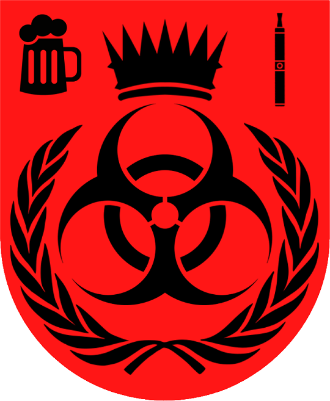

# Закон О Самоидентификации.

## Глава 1. Общие положения.

1. Настоящим законом устанавливается национальная символика Государства Токсичная Зона.

## Глава 2. Национальная Символика Токсичной Зоны.

1. Флаг Токсичной Зоны: 

2. Герб Токсичной Зоны:

